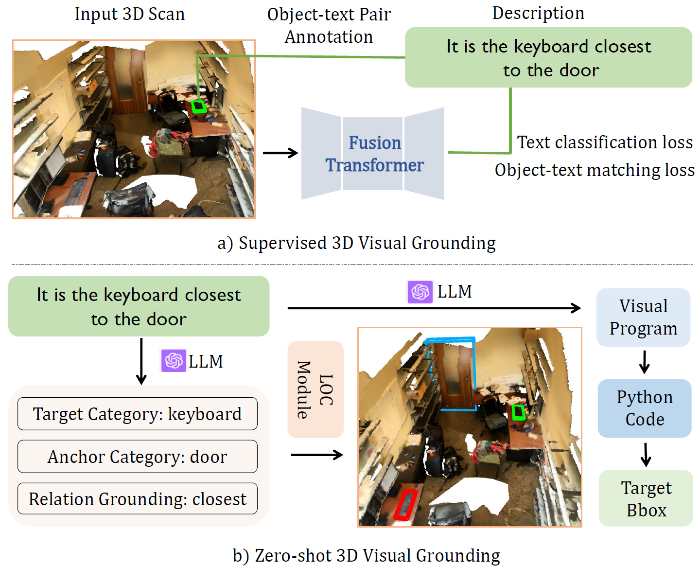

<p align="center">
  <h1 align="center">Visual Programming for Zero-shot Open-Vocabulary 3D Visual Grounding</h1>

  <p align="center">
    Zhihao Yuan, Jinke Ren, Chun-Mei Feng, Hengshuang Zhao, Shuguang Cui, Zhen Li
  </p>

  <h2 align="center">CVPR 2024</h2>


<p align="center">
    <a href='https://arxiv.org/abs/2311.15383'>
      
    </a>
    <a href='https://curryyuan.github.io/ZSVG3D/' style='padding-left: 0.5rem;'>
      
    </a>
  </p>

</p>


<!--  -->

  <p align="center">
    
  </p>

*Comparative overview of two 3DVG approaches.*
(a) Supervised 3DVG involves input from 3D scans combined with text queries,
guided by
object-text pair annotations, (b) Zero-shot 3DVG identifies the location of target
objects using
programmatic representation generated by LLMs, i.e., target category, anchor
category, and
relation grounding, thereby highlighting its superiority in decoding spatial relations and
object identifiers
within a given space, e.g., the location of the keyboard (outlined in green) can be
retrieved based on
the distance between the keyboard and the door (outlined in blue).


## Instructions

### Zero-shot evaluation
Download our preproceed 3D and 2D featrues from [here](https://cuhko365-my.sharepoint.com/:f:/g/personal/221019046_link_cuhk_edu_cn/Ev4ruFI2DW5FoqVdiPtpd4gBZALQi20oT7otg1zA-GOKRA?e=xkMf8T) and place them under `data/scannet` folder.

Run the following command:
```python
python visprog_nr3d.py
```


### Data Preparation

You can also process the features by yourself.

First, install the dependencies: 
```bash
cd ./models/pointnext/PointNeXt
bash install.sh
```

Prepare ScanNet 2D data following [OpenScene](https://github.com/pengsongyou/openscene/blob/main/scripts/preprocess/README.md) and 3D data following [vil3dref](https://github.com/cshizhe/vil3dref).

<!-- Download our pretrained classifier from [here](https://drive.google.com/file/d/1Q6Q6) which is fine-tuned from [ULIP](https://github.com/salesforce/ULIP), and place it under `weights` folder. -->

Then, run the following scripts:
```python
python preprocess/process_feat_3d.py
python preprocess/process_feat_2d.py
```

You can refer to `preprocess/process_mask3d.ipynb` for processing 3D instance segments.